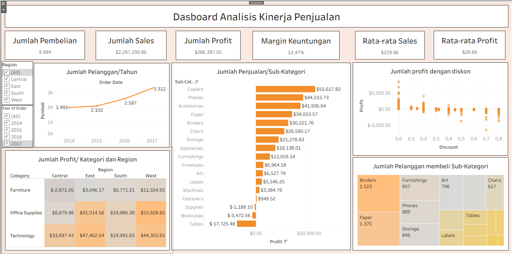

# Superstore Profitability & Discount Analysis

## Ringkasan
Membangun 1 dasbor Tableau interaktif untuk menjawab: di mana Superstore harus fokus untuk memaksimalkan keuntungan? Mencakup performa regional, profitabilitas kategori, dan dampak terukur dari tingkat diskon beserta rekomendasi strategis per wilayah.

## Problem Statement
Meskipun secara keseluruhan profitable, $156.131 hilang setiap tahun akibat diskon yang berlebihan. 1.871 pesanan (19,4%) mengalami kerugian. Wilayah Central menerapkan diskon rata-rata 30% pada kategori Furniture, dibandingkan dengan 13% di wilayah West — perbedaan struktural ini menjelaskan sebagian besar kesenjangan profitabilitas antar wilayah.

## Data Exploration
- **Sumber:** Dataset Sample Superstore
- **Ukuran:** 9.994 pesanan × 21 kolom
- **Periode:** 2014–2017, 4 wilayah AS (West, East, Central, South)
- **Kolom Utama:** Region/State/City, Category/Sub-Category, Sales, Profit, Discount

## Cleaning Data
- **Missing Value**: Tidak ada missing value
- **Duplikasi**: Tidak ada duplikasi
- **Outlier**: Terdapat outlier dan mengatasinya mempertahankannya

## Visualization Output
- **KPI:** $2,3J total penjualan · 12,47% margin keuntungan · $229 rata-rata penjualan · 1.871 pesanan merugi
- **Dampak diskon per pesanan:** 0% → +$66,90 · 1–10% → +$96,06 · 11–20% → +$24,74 · 21–30% → **-$45,68** · 31–50% → **-$156,28**
- **Berdasarkan wilayah:** West memimpin (margin 14,9%, 9,9% pesanan merugi); Central paling buruk (margin 7,9%, 31,9% pesanan merugi)
- **Berdasarkan sub-kategori:** Tables adalah penyumbang kerugian terbesar (-$17.725); Copiers paling menguntungkan (+$55.618)
- Texas dan Illinois menunjukkan penjualan tinggi namun profit negatif, sebuah pola yang tidak terlihat tanpa analisis tingkat dasbor

## Conclusion
- Data yang mengalami kerugian bisa disebabkan oleh adanya diskon yang terlalu besar yang membuat penjualan kehilangan 35% dari penjualannya.

## Recommendation
- Dengan ini dapat direkomendasikan untuk membatasi penggunaan diskon agar tidak melebihi batas margin keuntungan.
- Menetapkan kebijakan diskon yang lebih terukur, seperti menetapkan persentase maksimal diskon berdasarkan perhitungan harga pokok penjualan (HPP) dan margin yang diinginkan, serta melakukan evaluasi berkala terhadap produk-produk yang sering terdampak diskon besar agar strategi penjualan tetap menguntungkan dan berkelanjutan. 

## Tools yang Digunakan
Tableau Public · Python (EDA) · Calculated Fields · Heatmap · Scatter Plot · Slope Chart

---
*Bagian dari portofolio Data Analytics Bootcamp (2026)*

